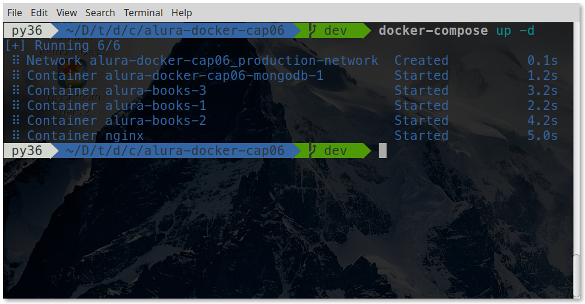

# curso-alura-docker
<p>
    
    <a href="https://github.com/my-study-area">
        
    </a>
    
    <a href="https://github.com/EliasGcf/readme-template/commits/master">
    
    </a>
</p>


Anotações do Curso de Docker: Criando containers sem dor de cabeça da Alura

> Para acessar os comandos para inciar o projeto final, acesse [Executando o projeto final](#executando-o-projeto-final)

## Atualizações
- [Atualiza a sintaxe das views da aplicação que utilizam marko](https://github.com/my-study-area/curso-alura-docker/commit/a82f85220a41d275343da7ebda409b697a20b8d5)
- [Atualiza as dependência da aplicação](https://github.com/my-study-area/curso-alura-docker/commit/1b3a25071bd546fed3ca781d3e59644f46b08aad)
- [Remove a propriedade ports dos services com a imagem alura-books para que não seja acessada no localhost](https://github.com/my-study-area/curso-alura-docker/commit/3cab6596a28a290420721ec0bdfd0485536fce7a)

## Módulo 01 - Introdução ao Docker
**Aula 01.01 - Introdução**

**Aula 01.02 - O problema das máquinas virtuais**
- um servidor físico gera vários problemas, entre eles o custo de luz e rede, e o seu alto tempo de ociosidade
- a virtualização veio para resolver o problema dos servidores físicos, porém, temos a desvantagem com a configuração inicial e atualizações de diversos sistemas operacionais

**Aula 01.03 - Desvantagens das máquinas virtuais**

**Aula 01.04 - A era dos containers**

**Aula 01.05 - Vantagens dos containers**

- Melhor controle do uso dos recursos do sistema operacional
- Agilidade na hora de criar e remover aplicações
- Maior facilidade na hora de trabalhar com diferentes versões de bibliotecas e linguagens


**Aula 01.06 - O que é o Docker?**

- Existe a Docker, Inc., empresa que toma conta do Docker e a tecnologia Docker dos containers.
- A Docker, Inc. no início era chamada de dotCloud que era uma empresa de PaaS (Platform as a Service) que utilizava a infraestrutura do Amazon Web Services (AWS) e introduziu o conceito de containers na hora de subir uma aplicação, dando origem ao Docker
- O Docker  é uma coleção de tecnologias, sendo `Docker Engine` a principal que faz o intermédio entre o sistema operacional, `Docker Compose`, um jeito fácil de definir e orquestrar múltiplos containers; o `Docker Swarm`, uma ferramenta para colocar múltiplos docker engines para trabalharem juntos em um cluster; o `Docker Hub`, um repositório com mais de 250 mil imagens diferentes para os nossos containers; e a `Docker Machine`, uma ferramenta que nos permite gerenciar o Docker em um host virtual.
- Quando a Docker, Inc. decidiu focar em manter o Docker tornou a tecnologia open source.

**Aula 01.07 - Tecnologias do Docker**

**Aula 01.08 - Instalando o Docker no Windows**
- Existem duas possibilidades para instalar o Docker no Windows. Temos a principal, utilizando o `Docker for Windows` e a alternativa, utilizando o `Docker Toolbox`.
- Os requisito para o Docker for Windows são:
    - Arquitetura 64 bits
    - Versão Pro, Enterprise ou Education.
    - Virtualização habilitada
- O `Docker Toolbox`  utiliza Oracle VirtualBox e  pode ser utilizados nos casos onde não possuimos os pré-requisitos

**Aula 01.09 Preparando o ambiente: Instalando Docker no Windows**

**Aula 01.10 Instalando o Docker no macOS**

**Aula 01.11 Preparando o ambiente: Instalando Docker no MacOs**

**Aula 01.12 Preparando o ambiente: Instalando Docker no Ubuntu**
```bash
# remove resões antigas
sudo apt-get remove docker docker-engine docker.io

# atualiza os pacotes
sudo apt-get update

# adiciona chave GPG oficial do repositório do Docker
curl -fsSL https://download.docker.com/linux/ubuntu/gpg | sudo apt-key add -

# adiciona o repositório do Docker às fontes do APT
sudo add-apt-repository \
   "deb [arch=amd64] https://download.docker.com/linux/ubuntu \
   $(lsb_release -cs) \
   stable"

# atualiza os pacotes 
sudo apt-get update

# instala o docker
sudo apt-get install docker-ce

# verifica a versão do docker
sudo docker version

# adiciona o usuário atual ao grupo docker
sudo usermod -aG docker $(whoami)
```
**Aula 01.13 - Hello World**
```bash
docker run hello-world
```

**Aula 01.14 - Consolidando seu conhecimento**

**Aula 01.15 - Uma alternativa online**
- [https://labs.play-with-docker.com/](https://labs.play-with-docker.com/)

**Aula 01.16 - O que aprendemos?**

## Módulo 02 - Trabalhando com imagens
**Aula 02.01 - Comandos básicos com containers**
```bash
docker ps #lista os containers em execução

docker ps -a #lista todos os containers

docker run ubuntu #executa container ubuntu e para

docker run ubuntu echo "Ola Mundo" #executa container, executa comando e para

docker run -it ubuntu #executa container no modo interativo no terminal

docker start 8676d1ee5355 #inicia um container criado

docker stop 8676d1ee5355 #para o container

#inicia um container criado no modo interativo
docker start -a -i 8676d1ee5355 
```

**Aula 02.02 - Layered File System**
```bash
docker ps -a

#remove o container pelo id
docker rm 1ee1942d0e30

#remove todos os containers
docker container prune

#lista as imagens de containers
docker images

#remove a imagem hello-world
docker rmi hello-world
```

**Aula 02.03 - Comandos do Docker**

**Aula 02.04 - Sobre o Layered File System**
- Toda imagem que baixamos é composta de uma ou mais camadas.

- Essas camadas podem ser reaproveitadas em outras imagens, acelerando assim o tempo de download.

- As camadas de uma imagem são de leitura, somente os container são de leitura e escrita (os container criam uma camada acima das camadas da imagem)

**Aula 02.05 - Praticando com o docker run**
```bash
#cria o container baseado na imagem dockersamples/static-site
docker run dockersamples/static-site

#para o container imediatamente
docker stop -t 0 8bcbf14dcf27

#cria o container desanexado do terminal
docker run -d dockersamples/static-site

#cria o container desanexado e mapeando uma porta automaticamente
docker run -d -P dockersamples/static-site

#exibe as porta mapeadas do container
docker port 428e510c6ef0

#cria o container desanexado, mapeando uma porta automaticamente
#e com o nome meu-site
docker run -d -P --name meu-site dockersamples/static-site

#cria o container desanexado e mapeando uma porta manualmente
docker run -d -p 12345:80  dockersamples/static-site

#cria o container desanexado, mapeando uma porta automaticamente
# e alterando a variável de ambienete AUTHOR
docker run -d -P -e AUTHOR="Adriano"  dockersamples/static-site

#para todos os container utilizando bash
docker stop -t 0 $(docker ps -q)

#para todos os container utilizando fish shell
docker stop -t 0 (docker ps -q)
```
> `docker-machine ip` exibe o ip utilizado pelo Toolbox

**Aula 02.06 - Acessando portas do container**

**Aula 02.07 - Para saber mais: Docker e DevOps**

**Aula 02.08 - Consolidando seu conhecimento**

**Aula 02.09 - O que aprendemos?**

## Módulo 03 - Usando volumes
**Aula 03.01 - Salvando dados com volumes**
```bash
#cria um container com volume
docker run -v "/var/www" ubuntu

#inspeciona as informações do container
docker inspect 10f2473b3929

# cria um container anexando ao meu terminal e cria
# um volume de uma pasta do host associada à /var/www do container 
docker run -it -v "/mnt/windows/adriano/temp/download/:/var/www" ubuntu
```

**Aula 03.02 - Sobre volumes**
- Muitas vezes removemos os containers após o uso. Volumes são usados para os dados que não devem ser removidos. É muito comum usar o container e apagá-lo após seu uso. Dessa forma também são removidos os dados desse container e aí entram os volumes que permitem salvar dados fora do container.

**Aula 03.03 - Lugar do volume**
- Um volume fica salvo no Docker Host, ou seja, fica salvo no computador onde a Docker Engine está rodando.

**Aula 03.04 - Rodando código em um container**
```bash
#cria um container mapeando uma pasta local associando ao /var/www,
#mapeando para uso da porta local 8080, iniciando no diretório de 
#trabalho /var/www e iniciando a aplicação com npm
docker run -p 8080:3000 \
  -v "/mnt/windows/adriano/documents/github/curso-alura-docker/volume-exemplo:/var/www" \
  -w "/var/www" node npm start

#com interpolação no bash
docker run -p 8080:3000 -v "$(pwd):/var/www" -w "/var/www" node npm start

#com interpolação no fish shell
docker run -p 8080:3000 -v (pwd):/var/www -w "/var/www" node npm start
```

**Aula 03.05 - Montando volume**    
Qual dos comandos abaixo configura o volume do diretório /var/www do container para C:\logs do Host?

R: `docker run -v "C:\logs:/var/www" ubuntu`

**Aula 03.06 - Interpretando o Inspect**    
Flavio é um programador com muita experiência no mundo Javascript, porém agora resolveu se aventurar no mundo do Docker. Ao pensar em como iria organizar os caminhos dos volumes em sua máquina e container, ele executou o comando docker inspect. Abaixo temos um pedaço da saída do comando docker inspect ID_DO_CONTAINER no terminal de Flavio, sobre a saída abaixo é verdade que:
```bash
"Mounts": [
    {
        "Type": "volume",
        "Name": "5e1cbfd48d07284680552e56087c9d5196659600ccd6874bfa3831b51ddd0576",
        "Source": "/home/Flavio/Desktop/volumes/caminho/_data",
        "Destination": "/var/opt",
        "Driver": "local",
        "Mode": "",
        "RW": true,
        "Propagation": ""
    }
]
```
R: `"/var/opt"` pertence ao container e será escrito no caminho `"/home/Flavio/Desktop/volumes/caminho/_data"` em nossa máquina.

**Aula 03.07 - Consolidando seu conhecimento**    

**Aula 03.08 - O que aprendemos?**    
- Que Container são voláteis, isso é, ao remover um, removemos os dados juntos
- Para deixar os dados persistente devemos usar Volumes
- Que volumes salvos não ficam no container e sim no Docker Host
- Como criar um ambiente de execução node.js


## Módulo 04 - Construindo nossas próprias imagens
**Aula 04.01 - Criando um Dockerfile**    
```Dockerfile
FROM node:latest
MAINTAINER "Adriano Avelino"
ENV PORT=3000
COPY . /var/www
WORKDIR /var/www
RUN npm install
ENTRYPOINT ["npm", "start"]
EXPOSE $PORT
```

```bash
#cria uma imagem baseada no Dockerfile
docker build -f Dockerfile -t adrianoavelino/node .

#cria um container baseado na imagem adrianoavelino/node
docker run -d -p 8080:3000 adrianoavelino/node
```

**Aula 04.02 - Analisando o Dockerfile**

**Aula 04.03 - Subindo a imagem do Docker Hub**
```bash
#faz login na conta do dockerhub
docker login

#envia a imagem pro dockerhub
docker push adrianoavelino/node

#baixa a imagem do dockerhub
docker pull douglasq/node
```

**Aula 04.04 - Novo Dockerfile**

**Aula 04.05 - Consolidando seu conhecimento**

**Aula 04.06 - O que aprendemos?**
- A entender o papel do arquivo `DockerFile` para criar imagens.
- O `Dockerfile` define os comandos para executar instalações complexas e com características específicas.
- Vimos os principais comandos como `FROM, MAINTAINER, COPY, WORKDIR, RUN, EXPOSE e ENTRYPOINT`
- A subir uma imagem criada através de um Dockerfile para o Docker Hub e disponibilizar para os desenvolvedores

Lembrando também:

  - as imagens são read-only sempre
  - um container é uma instância de uma imagem
  - para guardar as alterações a docker engine cria uma nova layer em cima da última layer da imagem

## Módulo 05 - Comunicação entre containers

**Aula 05.01 - Networking no Docker**
```bash
docker run -it ubuntu

#exibe o ip
hostname -i

#atualiza repositório e insta-la o ping
apt-get update && apt-get install iputils-ping

#testa a comunicação entre containers
ping 172.17.0.3

#cria a rede minha-rede usando o driver bridge
docker network create --driver bridge minha-rede

#cria container ubuntu1 na rede minha-rede
docker run -it --name ubuntu1 --network minha-rede ubuntu

#cria container ubuntu2 na rede minha-rede
docker run -it --name ubuntu2 --network minha-rede ubuntu

#testa comunicação por nome do container
ping ubuntu2
```

**Aula 05.02 - Rede Docker**
- Por padrão, os containers ficam na mesma rede com o nome bridge.
- Na rede padrão do Docker, só podemos realizar a comunicação utilizando IPs.
- Com docker inspect ID_DO_CONTAINER podemos verificar a qual rede ele pertence.

**Aula 05.03 - Criando uma rede**    
Com base no comando `docker network create --driver bridge local` podemos afirmar que:
- A instrução create não é opcional.
- Cria uma rede bridge chamada local.
- Utiliza o driver bridge.
- O parâmetro `--driver` indica qual driver será utilizado durante a criação da rede local.

**Aula 05.04 - Pegando dados de um banco**    
```bash
#cria um container da aplicação com a rede padrão
docker run -d -p 8080:3000 douglasq/alura-books:cap05

docker rm -f ID_DO_CONTAINER

#cria um container  do banco de dados com a rede minha-rede
docker run -d --name meu-mongo --network minha-rede mongo

#cria um container  da aplicação com a rede minha-rede
docker run -d -p 8080:3000 --network minha-rede  douglasq/alura-books:cap05
```
- acesse [http://localhost:8080/seed/](http://localhost:8080/seed/) para salvar os livros no banco de dados
- acesse [http://localhost:8080](http://localhost:8080/seed/) para visualizar os livros cadastrados

**Aula 05.05 - Sobre o comando pull**

**Aula 05.06 - Análise do comando**    
Com base no comando `docker run -d --name meu-mongo --network minha-rede mongo` podemos afirmar:
- Sobe um container na rede minha-rede.
- Executa o container em modo detached.

**Aula 05.07 - Consolidando seu conhecimento**

**Aula 05.08 - O que aprendemos?**    
- Que imagens criadas pelo Docker acessam a mesma rede, porém apenas através de IP.
- Ao criar uma rede é possível realizar a comunicação entre os containers através do seu nome.
- Que durante a criação de uma rede precisamos indicar qual driver - utilizaremos, geralmente, o driver bridge.

## Módulo 06 - Trabalhando com o Docker Compose
**Aula 06.01 - Entendendo o Docker Compose**    
- `Docker Compose` é uma das tecnologias aliadas do Docker, feita para nos auxiliar a orquestrar  múltiplos containers, ao invés de subir todos esses containers na mão
- Ele funciona a partir de um arquivo de texto `YAML` (extensão .yml)

**Aula 06.02 - Entendendo a aplicação**    

**Aula 06.03 - Análise de um DockerFile**    
```docker
FROM nginx:latest
MAINTAINER Douglas Quintanilha
COPY /public /var/www/public
COPY /docker/config/nginx.conf /etc/nginx/nginx.conf
EXPOSE 80 443
ENTRYPOINT ["nginx"]
CMD ["-g", "daemon off;"]
```
Com base no arquivo acima podemos verificar:
- Utilizamos a última versão disponível da imagem do nginx como base
- Copiamos o conteúdo da pasta public, que contém os arquivos estáticos, e um arquivo de configuração do NGINX para dentro do container.
- É executado o comando nginx, passando os parâmetros extras -g e daemon off.
- A  porta 80 e 443 estão abertas

**Aula 06.04 - Criando o docker-compose.yml**    
```yml
version: '3'
services:
    nginx:
        build:
            dockerfile: ./docker/nginx.dockerfile
            context: .
        image: douglasq/nginx
        container_name: nginx
        ports:
            - "80:80"
        networks: 
            - production-network
        depends_on: 
            - "node1"
            - "node2"
            - "node3"

    mongodb:
        image: mongo
        networks: 
            - production-network

    node1:
        build:
            dockerfile: ./docker/alura-books.dockerfile
            context: .
        image: douglasq/alura-books
        container_name: alura-books-1
        ports:
            - "3000"
        networks: 
            - production-network
        depends_on:
            - "mongodb"

    node2:
        build:
            dockerfile: ./docker/alura-books.dockerfile
            context: .
        image: douglasq/alura-books
        container_name: alura-books-2
        ports:
            - "3000"
        networks: 
            - production-network
        depends_on:
            - "mongodb"

    node3:
        build:
            dockerfile: ./docker/alura-books.dockerfile
            context: .
        image: douglasq/alura-books
        container_name: alura-books-3
        ports:
            - "3000"
        networks: 
            - production-network
        depends_on:
            - "mongodb"

networks: 
    production-network:
        driver: bridge
```

**Aula 06.05 - Responsabilidades do Docker Compose**    
- Executar o build de vários containers.
- Desligar os containers de maneira coordenada.
- Manipular diversos containers.
- Criar nova rede em qual os containers podem participar.

**Aula 06.06 - Instalando o Docker Compose no Linux**    
```bash
#baixa a versão mais nova do docker-compose
sudo curl -L https://github.com/docker/compose/releases/download/1.15.0/docker-compose-`uname -s`-`uname -m` -o /usr/local/bin/docker-compose

#adiciona permissão de execução
sudo chmod +x /usr/local/bin/docker-compose
```

**Aula 06.07 - Subindo os serviços**    
```bash
#constrói os containers
sudo docker-compose build

#inicia a aplicação
docker-compose up

#para a aplicação
docker-compose down

#inicia a aplicação em modo detach
docker-compose up -d

#exibe as informações do container como porta, nome e estado
docker-compose ps

#exemplo de ping de container pelo nome do container
docker exec -it alura-books-1 ping alura-books-2

#exemplo de ping de container pelo nome do serviço
docker exec -it alura-books-1 ping node2
```

**Aula 06.08 - Reinicializando containers**    
```bash
#para e remove os containers, redes, imagems e volumes
docker-compose down

#cria e inicia o container
docker-compose up

#restarta os serviços
docker-compose restart
```

**Aula 06.09 - Para saber mais: Docker e Microsserviços**    
**Aula 06.10 - Consolidando seu conhecimento**    
**Aula 06.11 - Docker Cheat Sheet - Os Comandos Utilizados**    
Segue a lista com os principais comandos utilizados durante o curso:

- Comandos relacionados às informações
  - `docker version` - exibe a versão do docker que está instalada.
  - `docker inspect` ID_CONTAINER - retorna diversas informações sobre o container.
  - `docker ps` - exibe todos os containers em execução no momento.
  - `docker ps -a` - exibe todos os containers, independentemente de estarem em execução ou não.

- Comandos relacionados à execução
  - `docker run NOME_DA_IMAGEM` - cria um container com a respectiva imagem passada como parâmetro.
  - `docker run -it NOME_DA_IMAGEM` - conecta o terminal que estamos utilizando com o do container.
  - `docker run -d -P --name NOME dockersamples/static-site` - ao executar, dá um nome ao container e define uma porta aleatória.
  - `docker run -d -p 12345:80 dockersamples/static-site` - define uma porta específica para ser atribuída à porta 80 do container, neste caso 12345.
  - `docker run -v "CAMINHO_VOLUME" NOME_DA_IMAGEM` - cria um volume no respectivo caminho do container.
  - `docker run -it --name NOME_CONTAINER --network NOME_DA_REDE NOME_IMAGEM` - cria um container especificando seu nome e qual rede deverá ser usada.

- Comandos relacionados à inicialização/interrupção
  - `docker start ID_CONTAINER` - inicia o container com id em questão.
  - `docker start -a -i ID_CONTAINER` - inicia o container com id em questão e integra os terminais, além de permitir interação entre ambos.
  - `docker stop ID_CONTAINER` - interrompe o container com id em questão.

- Comandos relacionados à remoção
  - `docker rm ID_CONTAINER` - remove o container com id em questão.
  - `docker container prune` - remove todos os containers que estão parados.
  - `docker rmi NOME_DA_IMAGEM` - remove a imagem passada como parâmetro.

- Comandos relacionados à construção de Dockerfile
  - `docker build -f Dockerfile` - cria uma imagem a partir de um Dockerfile.
  - `docker build -f Dockerfile -t NOME_USUARIO/NOME_IMAGEM` - constrói e nomeia uma imagem não-oficial.
  - `docker build -f Dockerfile -t NOME_USUARIO/NOME_IMAGEM CAMINHO_DOCKERFILE` - constrói e nomeia uma imagem não-oficial informando o caminho para o Dockerfile.

- Comandos relacionados ao Docker Hub
  - `docker login` - inicia o processo de login no Docker Hub.
  - `docker push NOME_USUARIO/NOME_IMAGEM` - envia a imagem criada para o Docker Hub.
  - `docker pull NOME_USUARIO/NOME_IMAGEM` - baixa a imagem desejada do Docker Hub.

- Comandos relacionados à rede
  - `hostname -i` - mostra o ip atribuído ao container pelo docker (funciona apenas dentro do container).
  - `docker network create --driver bridge NOME_DA_REDE` - cria uma rede especificando o driver desejado.

- Comandos relacionados ao docker-compose
  - `docker-compose build` - Realiza o build dos serviços relacionados ao arquivo docker-compose.yml, assim como verifica a sua sintaxe.
  - `docker-compose up` - Sobe todos os containers relacionados ao docker-compose, desde que o build já tenha sido executado.
  - `docker-compose down` - Para todos os serviços em execução que estejam relacionados ao arquivo docker-compose.yml.

**Aula 06.12 - O que aprendemos?**    
- A necessidade de usar o Docker Compose
- Configurar o build de vários containers através do docker-compose.yml
- subir e parar os containers de maneira coordenada com Docker Compose

**Aula 06.13 - Conclusão**    

## Executando o projeto final
```bash
# clona o projeto
git clone https://github.com/my-study-area/curso-alura-docker

# entra no diretório com o projeto final
cd curso-alura-docker/alura-docker-cap06

# constrói as imagens
docker-compose build

# inicia os container
docker-compose up -d

# verifica os status e demais informações
docker-compose ps

# alimenta o banco com os dados inciais
# Obs: também é possível acessar http://localhost/seed no navegador
curl http://localhost/seed -v
```
Acesse [http://localhost/](http://localhost/) no seu navegador para consultar os livros cadastrados anteriormente.


> A execução dos comandos está disponível no Youtube, no canal [Diário de um dev](https://www.youtube.com/watch?v=keTWO66VfVs)

Outros comandos:
```bash
# mongo

# acessa o terminal do container mongo
docker-compose exec mongodb bash

# conecta no mongo
mongo

# exibe os bancos de dados existentes
show dbs

# seleciona o banco de dados alura-books
use alura-books

# mostra as collections
show collections

# exibe as informações da collection books
db.getCollectionInfos({ name: "books" });

# lista os dados da collection books
db.books.find()
```
